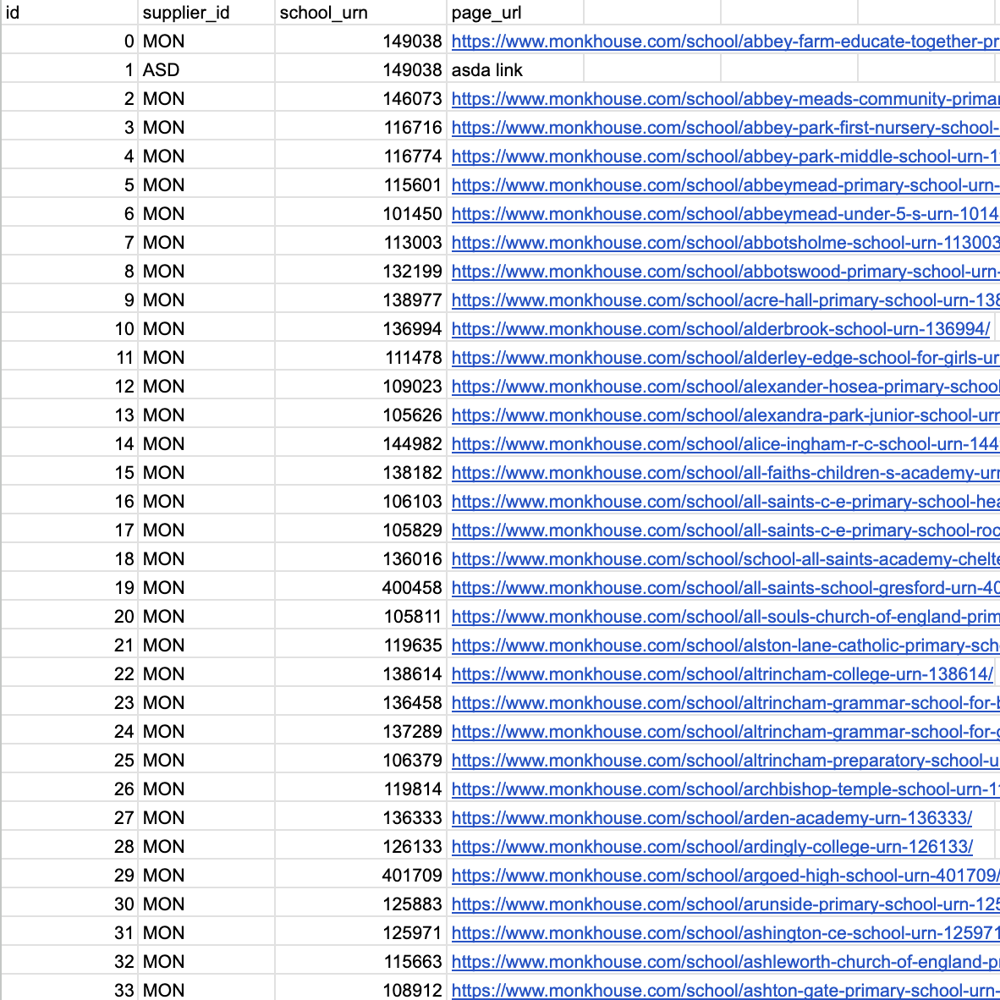
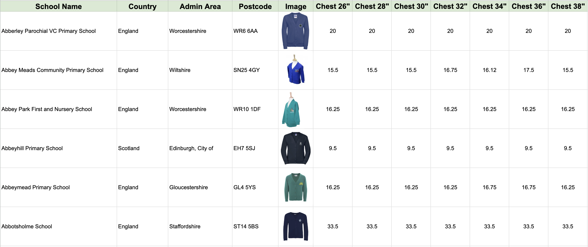
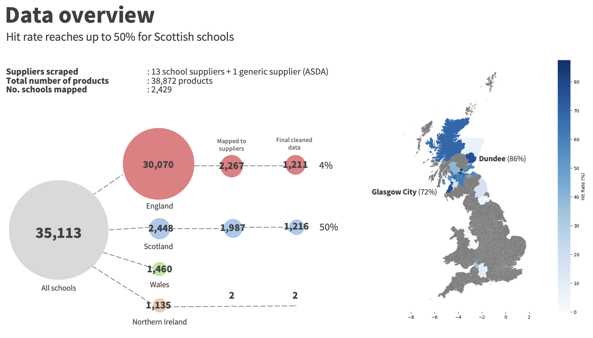
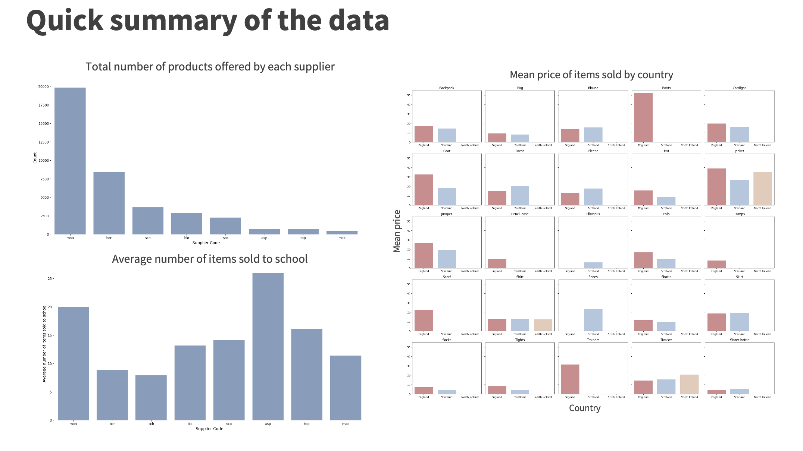

# scrapplier
A python package to scrape school and products information from the supplier website all across the United Kingdom. Scrapplier built on top of `undetected-chromedriver` and works well on dynamic websites. In the current version it supports more than 15 suppliers and can scrape the data from School level to Variant level. Scrapplier was created as part of the CTC-31 Hackathon.

(Please note that I haven't had the time to refactor the codes)

## Installation
- Open your terminal and create a new environment
    ```
    $ python -m venv scrapplier-venv
    ```
- Activate your environment
    ```
    $ source scrapplier-venv/bin/activate
    ```
- Install dependencies
    ```
    (scrapplier-venv) $ pip install -r requirements.txt
    ```
- Clone scrapplier repo
    ```
    (scrapplier-venv) $ git clone git@github.com:hariesramdhani/scrapplier
    ```
- Install scrapplier
    ```
    (scrapplier-venv) $ cd scrapplier
    (scrapplier-venv) scrapplier $ pip install .
    ```

## Example

```python
from scrapplier.scraper import Scraper

scraper = Scraper(username="test", password="test")

# Scrape Monkhouse
scraper.scrape(supplier="monkhouse")
```

Depending on the depth that you chose you will get the data for them 
- `monkhouse_schools.csv`: School information, including school logos and school pages on the supplier website, parameter `depth="schools"`
- `monkhouse_products`: Products information, all of the products that are being sold to specific schools, parameter `depth="products"`
- `monkhouse_variants`: Products variant information, all of the product variants, parameter `depth="variants"`

## Scraping logic (Lay terms)
Scraping using `undetected-chromedriver` (Selenium) works like a robot that mimics how a human would use a web browser to gather information from a website. Here’s a simple breakdown of how it works, especially when scraping data from a supplier's website:

1. **Automating the Browser**:  
   Selenium controls a web browser (like Chrome or Firefox) as if someone were clicking, typing, and scrolling on the website. It can open websites, click buttons, fill out forms, and even navigate through pages—just like a person would.

2. **Navigating to Supplier Websites**:  
   First, Selenium goes to the supplier's website, for example, a school uniform supplier. It "loads" the website, just as you would by typing the address into your browser.

3. **Finding the Information**:  
   Once the website is loaded, Selenium looks for specific elements on the page (like product names, prices, or images). It uses "selectors" (kind of like a map) to find these elements, which could be hidden in things like buttons or drop-down menus.

4. **Dealing with Dynamic Content**:  
   Many modern websites are "dynamic," meaning parts of the page don’t load immediately but after a few seconds or when you scroll down. Selenium waits for this content to appear, ensuring it gathers everything that's loaded, unlike simpler methods that might miss this information.

5. **Collecting the Data**:  
   Once Selenium finds the information (like product lists, prices, and school details), it "scrapes" or copies that data into a format you can use, such as a CSV file or a database. 

6. **Handling Complex Interactions**:  
   Some suppliers might require special actions, like logging in or clicking on specific school links. Selenium can handle these by filling in login forms or registering students, so you can access products specific to a school.

## Directory information
- `scrapplier`: The python package
- `data`: All of the data collected and generated during the study
    - `raw`: Raw data (output from Scrapplier)
    - `processed`: Python processed data to match the requirements (e.g. for database or for Matt's analysis)
        - `flat_file`: Contains example of flat file as requested by Matt
        - `database`: Database for the website

## Data Example
- Raw data

- Flat file
    

## Supplier support
In the current version of `scrapplier` it supports the scraping of 18 suppliers, the details about the depth and counts of products and schools can be found below (as of June 2024)
| id | supplier_code |      supplier_name      |             supplier_website            | website_template | school_cnt | product_cnt | product_variant_cnt | is_school_level_data_scraped | is_product_level_data_scraped | is_variant_level_data_scraped | is_generic_supplier | note                                     |
|----|:-------------:|:-----------------------:|:---------------------------------------:|:----------------:|:----------:|:-----------:|:-------------------:|------------------------------|:-----------------------------:|:-----------------------------:|:-------------------:|------------------------------------------|
|  0 | MON           | Monkhouse               | https://monkhouse.com                   |                  |      1,035 |      20,936 |             188,424 |             TRUE             |              TRUE             |              TRUE             |        FALSE        |                                          |
|  1 | BSW           | Blossom Schoolwear      | https://www.blossomsschoolwear.com/     | Shopify          |        261 |       4,807 |              30,284 |             TRUE             |              TRUE             |             FALSE             |        FALSE        |                                          |
|  2 | SME           | Schoolwear Made Easy    | https://www.schoolwearmadeeasy.com      | Shopify          |        679 |       4,703 |              29,628 |             TRUE             |              TRUE             |             FALSE             |        FALSE        |                                          |
|  3 | SCS           | Scotcrest Schools       | https://www.scotcrestschools.co.uk/     |                  |        192 |       2,402 |              15,132 |             TRUE             |              TRUE             |             FALSE             |        FALSE        |                                          |
|  4 | MGS           | MacGregor Schoolwear    | https://macgregorschoolwear.co.uk       | Woocommerce      |        159 |         488 |               3,074 |             TRUE             |              TRUE             |             FALSE             |        FALSE        |                                          |
|  5 | MYC           | MyClothing              | https://myclothing.com/                 |                  |      7,728 |             |                     |             FALSE            |             FALSE             |             FALSE             |        FALSE        |                                          |
|  6 | SUS           | School Uniform Scotland | https://schooluniformscotland.com/      | Woocommerce      |         13 |         710 |               4,473 |             TRUE             |              TRUE             |             FALSE             |        FALSE        |                                          |
|  7 | AAG           | Aspire Academy Glasgow  | https://aspireacademyglasgow.com/       |                  |         40 |         766 |               4,825 |             TRUE             |              TRUE             |             FALSE             |        FALSE        |                                          |
|  8 | AAS           | Alan Santry Schoolwear  | https://www.alansantryschoolwear.co.uk/ |                  |         38 |         260 |               1,638 |             TRUE             |              TRUE             |              TRUE             |        FALSE        |                                          |
|  9 | BOE           | Border Embroideries     | https://www.border-embroideries.co.uk/  |                  |      1,374 |      10,611 |                     |             TRUE             |              TRUE             |             FALSE             |        FALSE        |                                          |
| 10 | DIS           | Direct Schoolwear       | https://directschoolwear.co.uk/         |                  |         76 |             |                     |             TRUE             |             FALSE             |             FALSE             |        FALSE        | Has material info, will scrape later     |
| 11 | STE           | Stevensons              | https://www.stevensons.co.uk/           |                  |        699 |             |                     |             TRUE             |             FALSE             |             FALSE             |        FALSE        | Very good website, very tricky to scrape |
| 12 | TRU           | Trutex                  | https://www.trutex.com/                 |                  |            |             |                     |             FALSE            |             FALSE             |             FALSE             |        FALSE        | Need school LEA code                     |
| 13 | BAN           | Banner                  | https://www.banner.co.uk                |                  |            |             |                     |             FALSE            |             FALSE             |             FALSE             |         TRUE        | Not specific by schools                  |
| 14 | DAL           | David Luke              | https://www.davidluke.com/              |                  |            |             |                     |             FALSE            |             FALSE             |             FALSE             |         TRUE        | Not specific by schools                  |
| 15 | UND           | Uniform Direct          | https://www.uniform-direct.com/         |                  |        358 |             |                     |             TRUE             |             FALSE             |             FALSE             |        FALSE        |                                          |
| 16 | TFS           | Top Form Schoolwear     | https://www.top-form.co.uk/             |                  |         58 |         846 |               5,329 |             TRUE             |              TRUE             |             FALSE             |        FALSE        |                                          |
| 17 | SMS           | Smart Schoolwear        | https://www.smartschoolwear.co.uk/      |                  |         91 |             |                     |             TRUE             |             FALSE             |             FALSE             |        FALSE        |                                          |
| 18 | PIS           | Pinder Schoolwear       | https://pindersschoolwear.com/          |                  |        263 |             |                     |             TRUE             |             FALSE             |             FALSE             |        FALSE        |                                          |

## Initial findings
### Overview of the cleaned data that can be used for the analysis


### Overview of what can be done with the data
Quick example of descriptive stastics of the data


## What have been done so far
- [X] Scrape more than 10+ suppliers data
- [X] Try to connect the scraped data to the school database
- [X] Create the website where we can show the comparison between the generic and supplier price
- [X] Give an example of what kind of analyses can be done with the data

## Limitations of the current approach
- Some suppliers do not clearly indicate whether a product is mandatory or optional for purchase.
- Accessing certain suppliers' products can be challenging; for example, with Stevensons, you must register your child with a specific school before viewing their products.
- Supplier information may be outdated, meaning some suppliers may stop providing uniforms for certain schools or begin supplying them.
- Prices may fluctuate, although the frequency of these changes is uncertain.
- Some schools, particularly in England, are not covered by the current suppliers, so the pool of suppliers we scrape from needs to be expanded.
- Some data may be incomplete or inaccurate and will require additional cleaning and validation.
- Product categorization in the flat file is overly simplistic, relying on basic string matching that may need refinement.
- Legality of web-scraping isn't very clear (Grey area).

## Potential analyses that can be done with the current data
- **Supplier Coverage**: Analyze which suppliers cover the most schools or regions and identify gaps in uniform availability.
- **Cost Difference**: Compare the cost difference between generic uniforms and supplier-branded uniforms for specific schools.
- **Price Trends**: Track and compare price changes for uniforms across different suppliers over time.

## Future Directions and Areas to Explore

1. **Expand Supplier Pool**  
   Continue adding new suppliers to the scraping process, especially those covering regions or schools currently not included. This will ensure comprehensive coverage, particularly in underrepresented areas like England. Additionally, expanding beyond 18 suppliers could improve the variety of products and pricing options available for analysis.

2. **Enhance Data Validation and Cleaning**  
   Implement more advanced data cleaning and validation techniques to handle incomplete or inaccurate data more efficiently. This could involve automated data quality checks, missing value imputation, and refining the categorization process to move beyond basic string matching.

3. **Improve Product Categorization**  
   Develop more sophisticated product categorization methods, such as natural language processing (NLP) or machine learning techniques, to better group products based on attributes like school type, uniform type, or seasonality. This would provide more accurate analysis and reporting.

4. **Handle Dynamic and Restricted Access Websites**  
   Explore alternative ways to scrape websites like Stevensons that require user registration or dynamic interaction. Possible solutions could include developing more advanced scraping algorithms, investigating API access, or collaborating directly with suppliers for data sharing.

5. **Monitor Price Fluctuations and Trends**  
   Implement a system to track and monitor price changes over time for both generic and supplier-branded uniforms. This would allow for detailed price trend analysis and insights into how frequently prices change and which suppliers tend to have more volatile pricing.